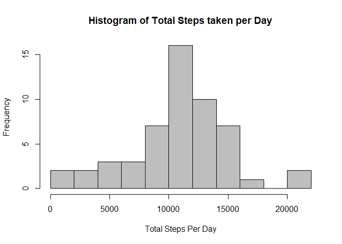
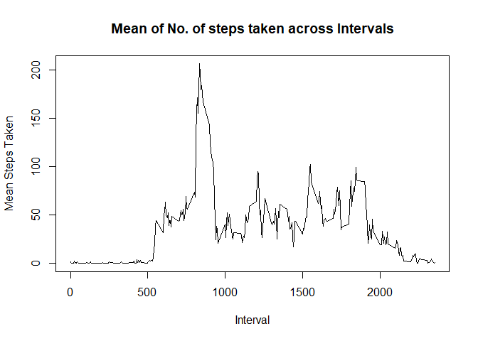
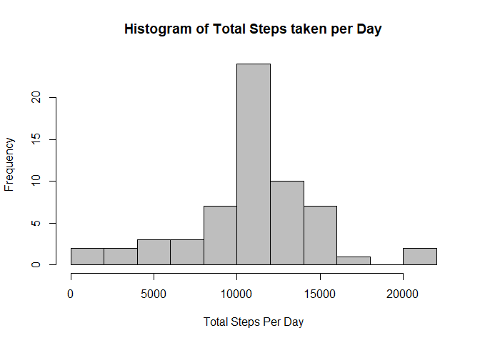
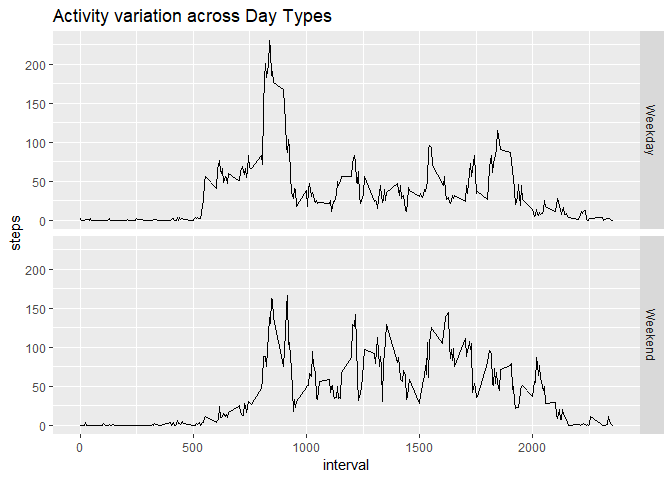

## Loading and preprocessing the data
### Reading the CSV File

```r
activityData <- read.csv(file = "activity.csv")
head(activityData)
```

```
##   steps       date interval
## 1    NA 2012-10-01        0
## 2    NA 2012-10-01        5
## 3    NA 2012-10-01       10
## 4    NA 2012-10-01       15
## 5    NA 2012-10-01       20
## 6    NA 2012-10-01       25
```

### Converting date column of dataset from factor to Date

```r
activityData$date <- as.Date(activityData$date,format = "%Y-%m-%d")
```

## What is mean total number of steps taken per day?

```r
totalSteps <- aggregate(steps~date,data = activityData,FUN = sum,
                        na.rm =T)
```

### Plotting Histogram of total steps taken per day

```r
hist(totalSteps$steps,col = "grey",breaks = 10,xlab = "Total Steps Per Day",
     main = "Histogram of Total Steps taken per Day")
```

<!-- -->

### Mean of total Steps taken per day

```r
mean(totalSteps$steps)
```

```
## [1] 10766.19
```

### Median of total Steps taken per day

```r
median(totalSteps$steps)
```

```
## [1] 10765
```

## What is the average daily activity pattern?
### Getting Mean of steps over each interval across all days

```r
intervalMeanSteps <- aggregate(steps~interval,data = activityData,
                               FUN = mean,na.rm =T)
```

### Time-Series plot of mean steps across intervals

```r
with(intervalMeanSteps,plot(steps~interval,xlab = "Interval",
                            ylab = "Mean Steps Taken",type = "l",
                            main = "Mean of No. of steps taken across Intervals"))
```

<!-- -->

### Interval at which maximum steps were recorded

```r
activityData$interval[which.max(activityData$steps)]
```

```
## [1] 615
```

## Imputing missing values
### Total Number of Rows having NA's

```r
sum(complete.cases(activityData) == FALSE)
```

```
## [1] 2304
```

### Imputing the NA's with mean of that interval across data and saving in a new variable

```r
library(dplyr)
newActivityData <- activityData %>% group_by(interval) %>%
        mutate(steps = ifelse(is.na(steps),mean(steps,na.rm = T),steps))
```

### Analysing New Data with imputed values

```r
totalStepsNew <- aggregate(steps~date,data = newActivityData,FUN = sum,
                        na.rm =T)
```

### Plotting Histogram of total number of steps taken each day

```r
hist(totalStepsNew$steps,col = "grey",breaks = 10,xlab = "Total Steps Per Day",
     main = "Histogram of Total Steps taken per Day")
```

<!-- -->

### Mean of total Steps taken per day for new data
### There is no change in mean as we are imputing the mean values

```r
mean(totalStepsNew$steps)
```

```
## [1] 10766.19
```

### Medan of total Steps taken per day for new data
### A slight change is observed in median it is now equal to mean value

```r
median(totalStepsNew$steps)
```

```
## [1] 10766.19
```

## Are there differences in activity patterns between weekdays and weekends?
### Making another column with Day Type

```r
newActivityData <- mutate(newActivityData,daytype = ifelse(weekdays(date) %in% c("Saturday","Sunday"),"Weekend","Weekday"))
```

### Aggregating mean of steps taken across intervals and different daytypes

```r
intDayStepMean <- aggregate(steps~interval+daytype,data = newActivityData,
                            FUN = mean)
```

### Plotting Panel time-series plot for mean steps in intervals for different daytype using ggplot2 package

```r
library(ggplot2)
g <- ggplot(intDayStepMean,aes(interval,steps))
g + geom_line() + facet_grid(daytype ~.) + 
        ggtitle("Activity variation across Day Types")
```

<!-- -->
